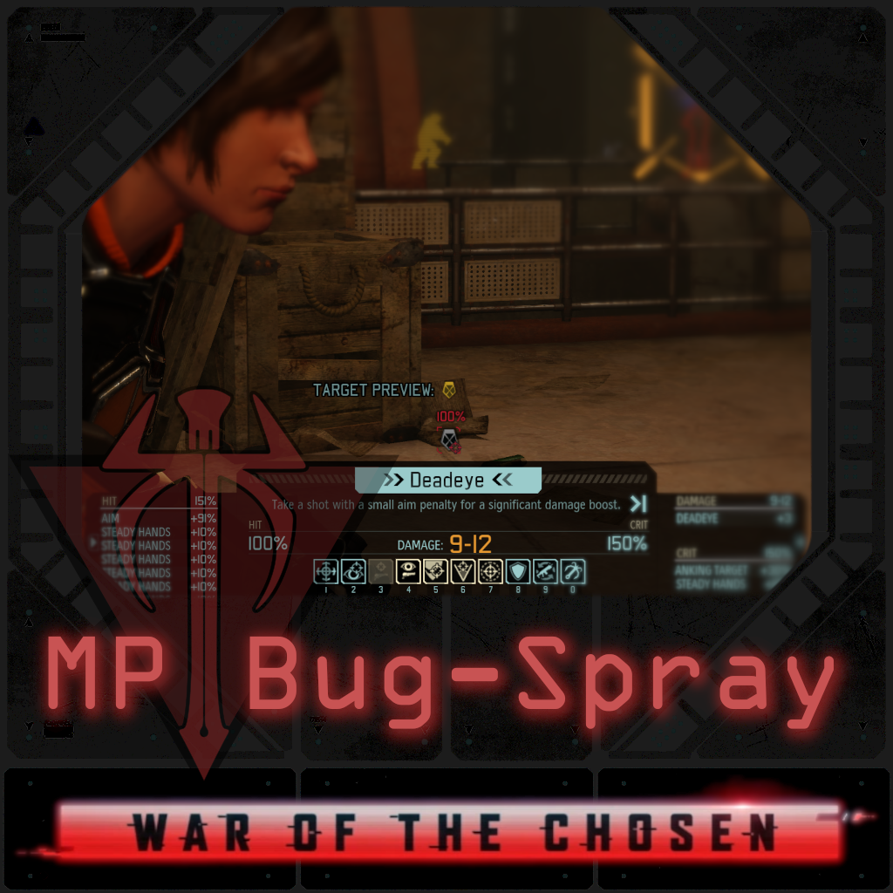

# [WotC] MP Bug-Spray

## About The Mod

This mod is based on a dream to fix all the bugs in XCOM 2 WotC Multiplayer. It is currently under development and is available as is on the Steam Workshop [here](https://steamcommunity.com/sharedfiles/filedetails/?id=2391060667).

## Development

### Discussion channel

For the most part, discussion happens in the #xcom-multiplayer channel of the [XCOM Discord Server](https://discord.gg/tWTMxvU). We use the server to talk about and test bug fixes for the multiplayer game mode.

### Code style

The code style is very similar to the one used by the [X2WOTC Community Highlander](https://github.com/X2CommunityCore/X2WOTCCommunityHighlander):

* Soft Tabs (4 spaces)
* Braces always on a new line
* Max line length of 79 characters
* Liberal use of space between blocks
* Braces even for one-line if/else bodies
* One extra indentation on line continuations
  
The following code should illustrate all of this:

```unrealscript
var config bool bLog;

//---------------------------------------------------------------------------//

static function CompleteStrategyFromTacticalTransfer()
{
    local XComOnlineEventMgr EventManager;
    local array<X2DownloadableContentInfo> DLCInfos;
    local int i;

    UpdateSkyranger();
    CleanupProxyVips();
    ProcessMissionResults();
    SquadTacticalToStrategyTransfer();

    EventManager = `ONLINEEVENTMGR;
    DLCInfos = EventManager.GetDLCInfos(false);
    for (i = 0; i < DLCInfos.Length; ++i)
    {

        `Log("Example Log with line continuation and DLC Identifier argument:"
            @ "Index:" @ i, default.bLog, 'ThisModsID');
        DLCInfos[i].OnPostMission();
    }
}
```

## Contribution
Both Code and Testing contributions are welcome!
